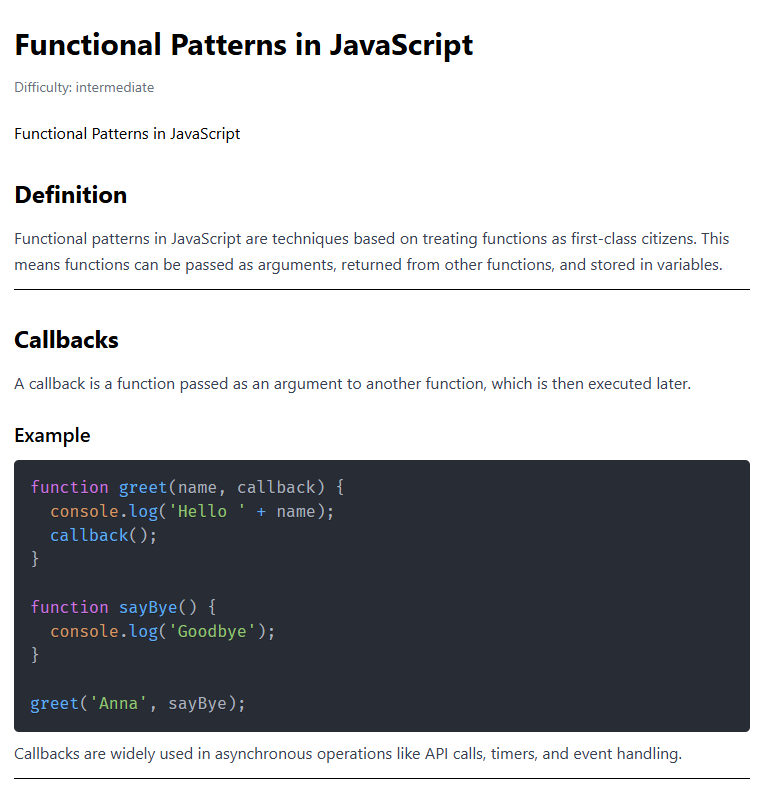

# Дата: 2026-03-20

## **Что было сделано:**

- Улучшил страницу Dashboard, теперь отображает список топиков, пока без стилей, просто вывожу топики из FireStora, стили будут допиливать тимейты, написал пару функций по работе с файртором одна выводит список топиков, другая отдельный топик.
- Добавил станицу TopicPage которая выводится через динамический роутинг, в зависимости от выбраного топика, и соотвественно подгружается документ из FireStore.
- Добавил компонент MarkdownRenderer что бы контект который подружается из базы, красиво отображался, после гугления и общения ИИ решил использовать библиотеку
  react-markdown и прикрутить к ней react-syntax-highlighter и remark-breaks, пришлось повозится с ними, несколько раз переделывая контент который подтягивается из базы. Вроде получилось симпотично.
  

## **Проблемы:**

Были проблемы с рендером текста топика который подтягивается из базы, несколько раз меня формат отображения, в итоге пришол к MD/

## **Мысли / Планы:** Что буду делать дальше?

Дальше так же хочу сделать начальную вертку компонекто и структуру документов в базе для тестов.

## **Затраченное время:**

3-5 часов.
